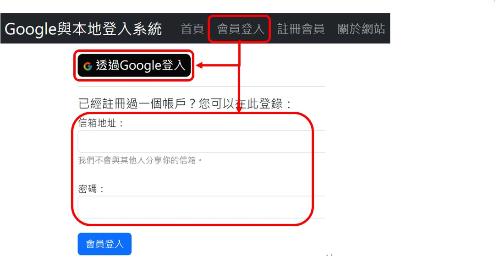
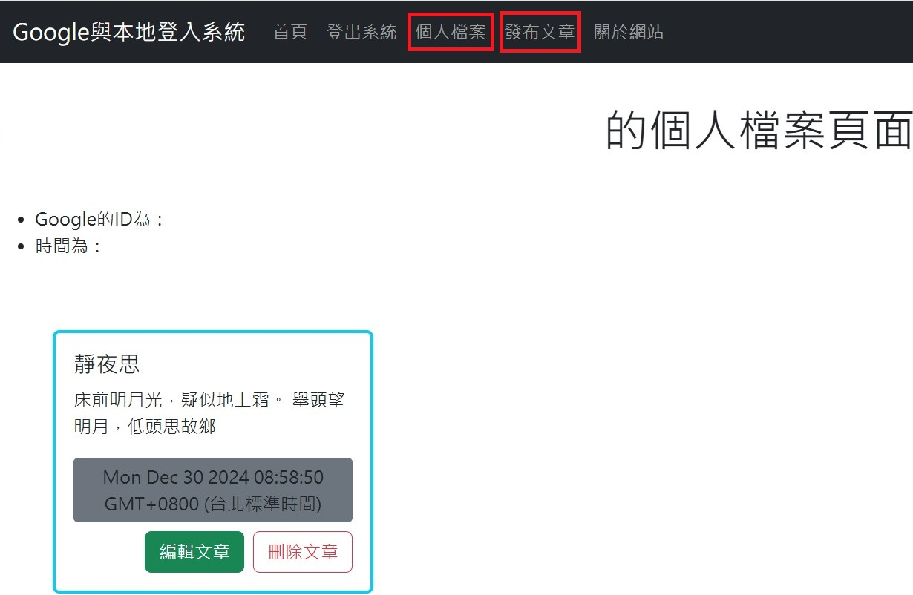

# Google登入與本地登入系統
1. 本專案框架為Experss.js
2. OAuth2.0與Passport.js實現第三方授權登入(本專案為Google登入)
同時實現本地登入系統
## 目標
1. 讓使用者能夠選擇本地登入或是Google登入  
   
3. 登入後，使用者能夠發布文章，且管理過去發布過得文章
   
## 套件
1. Express
2. dotenv
3. mongoose
4. express-session
5. passport
6. passport-google-oauth20
7. passport-local
8. bcrypt
9. connect-flash
10. method-override
## 功能
1. 使用OAuth2.0與Passport.js完成Google登入
   * 請向Google申請OAuth2.0的clientID和clientSecret並妥善保管，同時設定redirect URL
```javascript
passport.use(
   new GoogleStrategy(
   {
      clientID: GOOGLE_CLIENT_ID,
      clientSecret: GOOGLE_CLIENT_SECRET,
      callbackURL: "{主頁_URL或是localhost}/auth/google/redirect",
   }
```
2. MongoDB儲存會員資料
   * 設定好你的connection string，並妥善保管
```javascript
   mongoose.connect(process.env.MONGODB_CONNECTION)
```
2. EJS製作出 主頁面/註冊/登入/個人頁面/發布文章等頁面
3. 會員帳號密碼(auth-routes)相關 RESTful API  
   1. 註冊會員 POST "/signup"
      ```javascript
      {
         name,
         email,
         password
      }
      ```
   2. 登入會員 GET "/login"
   3. 登出會員 GET "/logout"
   4. Google登入 GET "/google"
   5. 本地登入成功，重新導向 POST "/login"
   6. Google登入成功，重新導向 GET "/google/redirect"  
4. 會員資料(profile-routes)相關 RESTful API  
   1. 確認使用者的身分 GET "/"
   2. 發布文章頁面 GET "/post"
   3. 發布文章 POST "/post"
      ```javascript
       {
         title,
         content
      }
      ```
   5. 進入編輯文章 GET "/{post_id}/edit"
   6. 編輯文章 PUT "/{post_id}"
       ```javascript
       {
         title,
         content
      }
      ```
   7. 刪除文章 DELETE "/{post_id}"
5. 本專案使用[Render](https://render.com/)網站進行部署，前往[Google登入與本地登入系統](https://loginwebsite-fciz.onrender.com)  
## 注意事項
因Render網站的決策，本專案的Server不使用時會進入睡眠，所以在進入本網站時會需要等待30秒以上。
## 問題
HTML form 預設只能使用 GET/POST method !! 如何解決?  
1. 安裝method-override套件可以解決HTML form無法傳送PUT/PATCH/DELETE的問題
2. 在設定所有route之前加入
   ```javascript
   app.use(methodOverride("_method"))
   // 設定routes
   ....
   ```
   讓每一筆請求都會先以 methodoverride 進行前置處理
